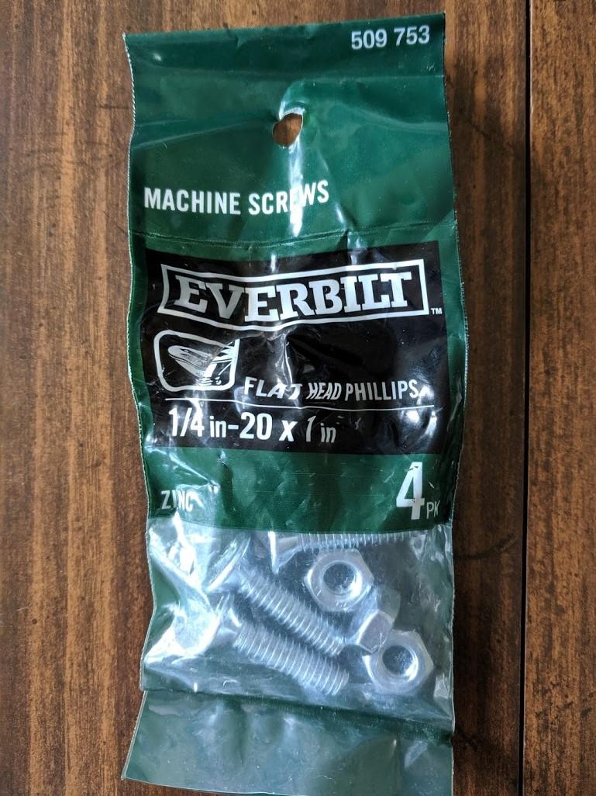
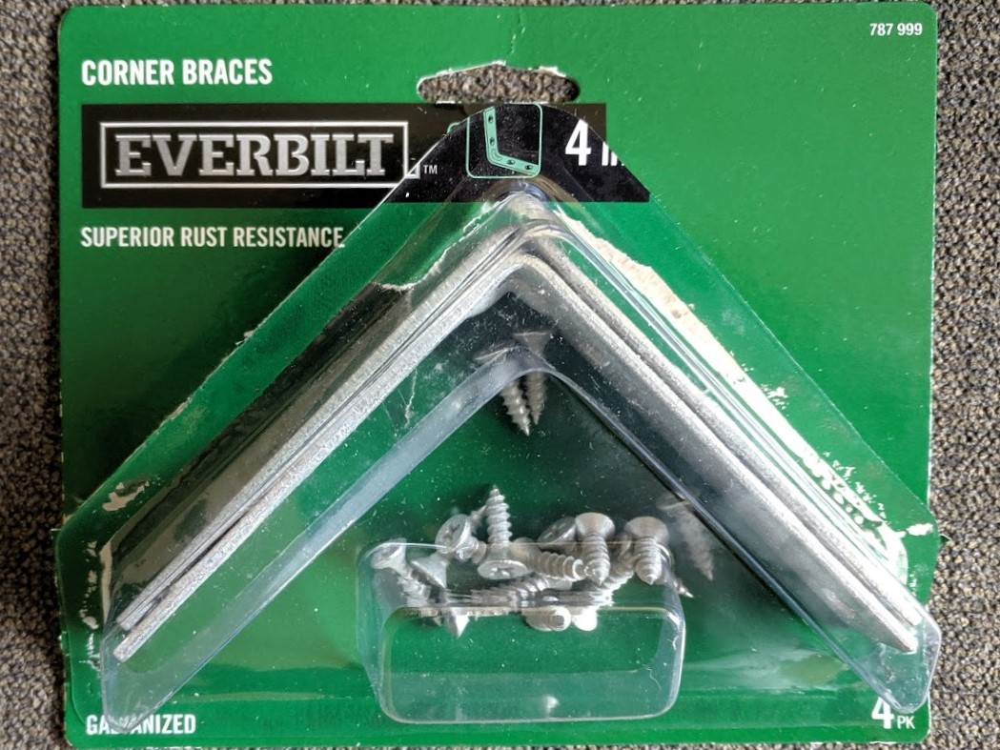
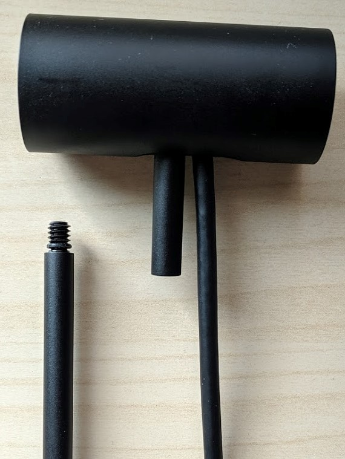
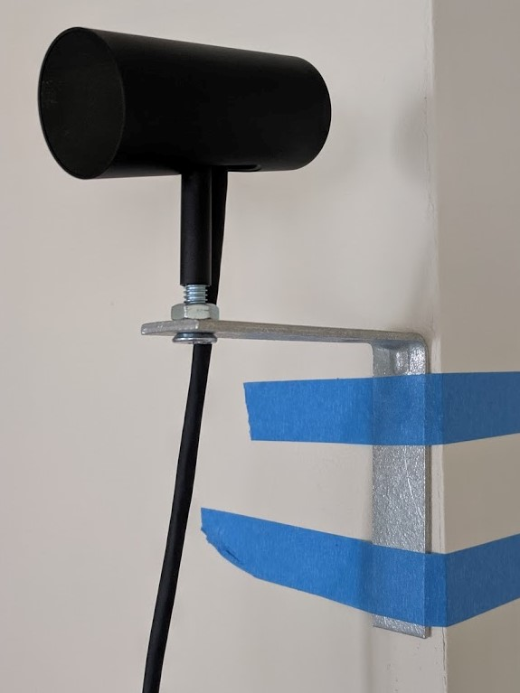
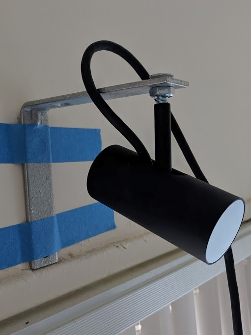
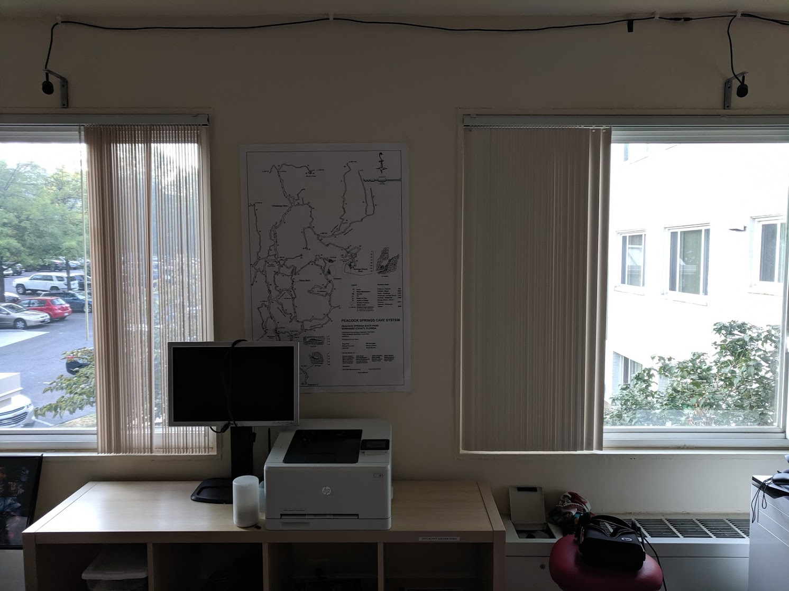
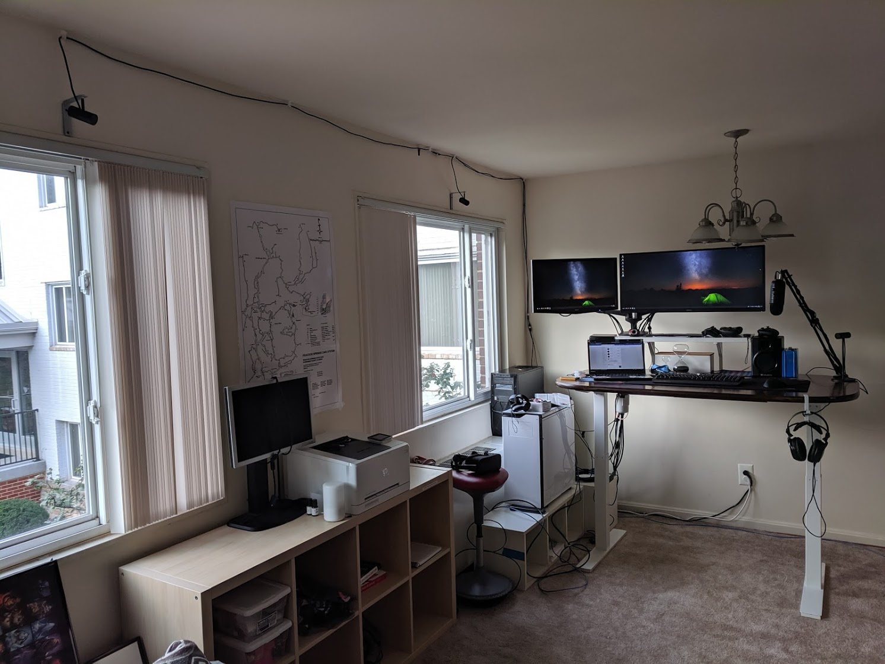
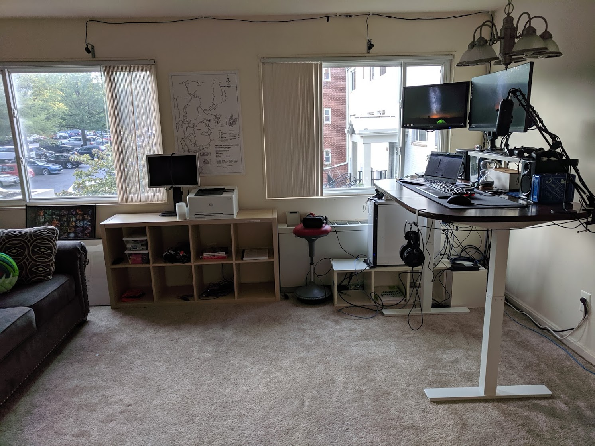

I was initially going to get some small bookshelves to put my Oculus sensors on,
but you can take your Oculus sensors off the stand!
This way you wont have an awkward way to mount the sensors against the wall.

I also have a 3rd rear sensor, but when I was (re)setting up my sensors,
I ended up just leaving it on my desk.
The parts list below was from me shopping at Home Depot assuming I was going to mount all 3 against the wall.

Need:

1. 1/4in-20 X 1in Machine Screws (4 pack -- it comes with screws and nuts, you need both): $1.18
2. 4in Corner Brace (4 pack): $7.24

Optional:

1. Temporary sensor setup: Painters tape, or anything that won't strip off your paint.
1. To mount the brackets against the wall (Home Depot): 3 1/2" x 3/4" Velcro strips (4 pack): $2.98
2. Cable management: 1/2" plastic KWIK Clip (4 pack) (Home Depot): 2 x 3.28 = \$6.56
3. USB extension for sensors (Micro Center): 2 x 10Ft QVS USB 2.0 Extension Cable A to A: 2 x 19.99 = $39.98

Tools:

You're also going to need a Phillips head screwdriver and pliers
to tighten the nut without moving and/or loosening the sensor

<!-- more -->

## The Parts

Here's what the parts look like:

1/4in-20 X 1in Machine Screws (4 pack): $1.18

4in Corner Brace (4 pack): $7.24

## Now the Assembly

1. Remove the Sensor
2. Mount the sensors on the brace
3. Finalize the mounts

### Remove the sensor

The top of the sensor screws off.
I ended up taking just the base stand with me to Home Depot to check the type of screw that was needed.
1/4in-20 worked for me. I found the 1" long screws was enough to connect everything together nicely.

### Mount the sensors on the brace

You can mount the sensors to the brace any way you want,
but I found that it was better to mount the sensors upside-down
since the sensors pivot upwards (on the stand) more than the other direction.
Also the entire rig is pretty light, so something like painters tape can hold up the entire unit against the wall 
(it's too heavy for painters tape to hold on the ceiling)
for you to try to get everything in the right place.
I had to do a lot of adjustments during the Oculus sensor setup.

Sensors right-side up:

Sensors upside-down:

###  Finalize the mounts

Seriously, don't screw or mount (I used the 3 1/2in Velcro strips) until **after** you go though the Oculus sensor setup.
I had to go back and adjust placement and angles multiple times.
I even had to scrap my initial idea of mounting the rear sensor against the wall because it was too far away from the other sensors, and I found it awkward to mount it on the ceiling.

Here's what the front 2 sensors look like, you actually need to pivot them inwards a lot more than I thought,
they're almost at 45-degrees and pretty much point right at you when you're in the middle of the play area.

Here's the entire setup looks like, with the 3rd (rear) sensor on my desk by the microphone.
What's not pictured: the train wreck of packaging, boxes, papers, cables beind me :p

## What I would do differently

If I was more motivated, I would've found a way to mount the rear sensor on the ceiling behind me.
But It didn't seem like the Oculus sensor could pivot downward enough with the braces up there.
I also wasn't that motivated to have it on the ceiling,
because now I get to return my 39ft USB extension cable from Micro Center ($$$$).

If I living in a more permanent location I would've gotten a better cable management system than the plastic clips.
By the electrical section in Home Depot there were long adhesive wire management cases that would hide the black cables **much** better.

The way my computer was setup, one of the 10ft USB extensions was too long,
and the other was too short.
I had to use a another USB extension for the sensor that was further away.

Also, my standing desk was my old childhood dining room table that I just (i.e., last night) upgraded with
the [Autonomous.ai Home Edition DIY legs](https://www.autonomous.ai/)
