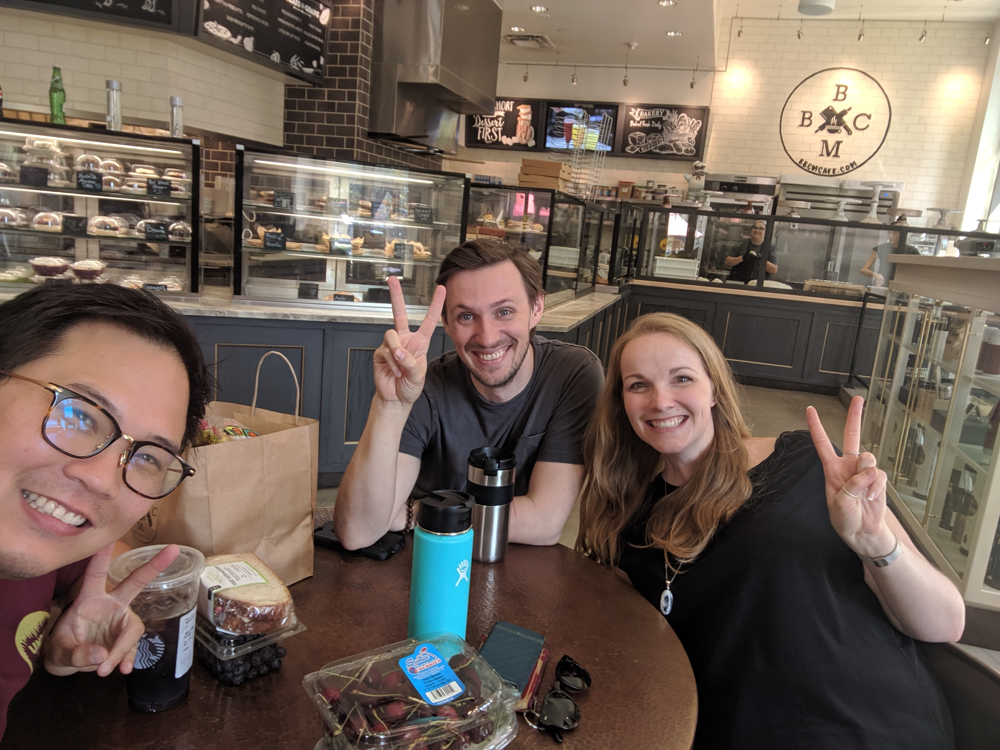
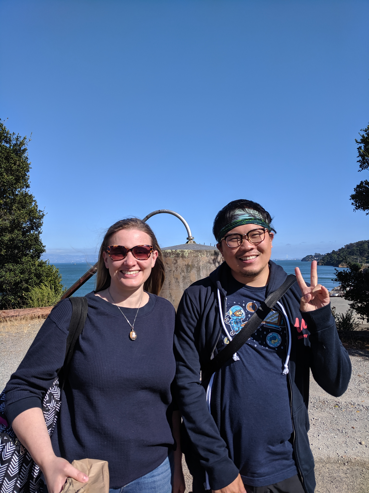
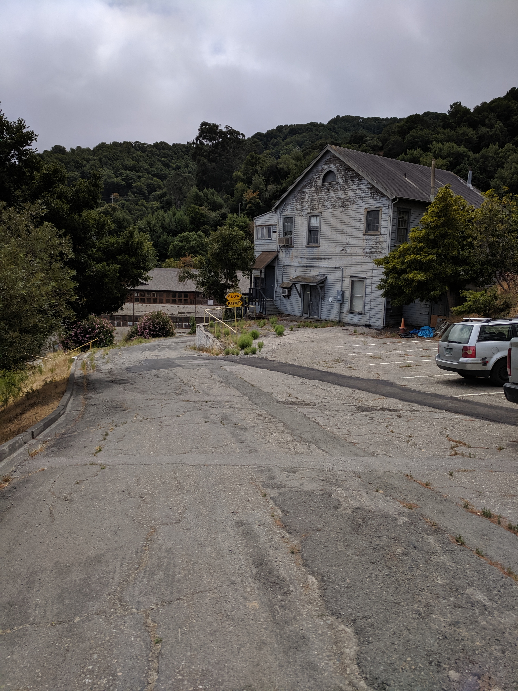
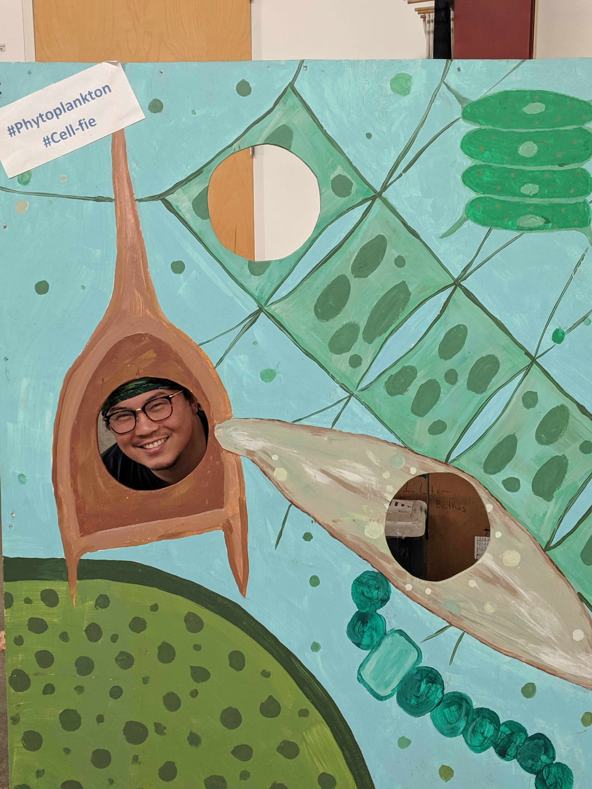
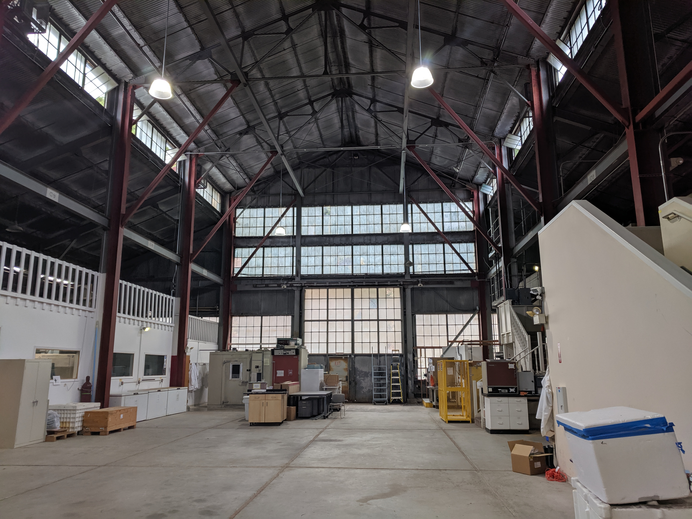
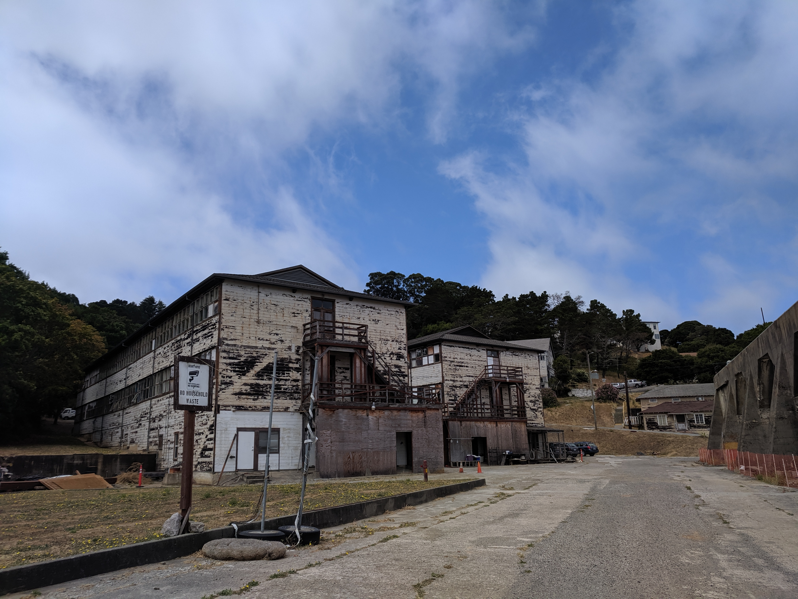

I've had a lot of time to think about my time as an RStudio intern.
When I do,
I usually end up with a few words in my head before I'm flooded with
(good) emotions and struggle with finding the words to convey my thoughts.
The last time I tried to write something like this went a little like
[this](https://software-carpentry.org/blog/2016/10/what_swc_means_to_me.html).
What I can say is this:
whatever you thought it was like working at RStudio,
is (probably) true.

<!-- more -->

From a technical perspective,
the most jarring part of the work was transitioning from a user of the R language
to a developer.
I've taught workshops and written R packages,
but nothing came close to the type of code I had to write for my internship.
I think my only saving grace was I was familiar enough with Git,
so I didn't have to deal with
[workflow](https://daniel.rbind.io/2019/08/27/git-squash-and-merge-workflow/)
issues.

### The project

I was on the
[education team](https://education.rstudio.com/)
and worked with worked with
[Garrett Grolemund](https://twitter.com/statgarrett)
and
[Barret Schloerke](https://twitter.com/schloerke)
(I can never spell their names properly without looking it up, and it didn't help one of the other interns was
[Malcolm Barrett](https://twitter.com/malco_barrett)
)
on [`gradethis`](https://github.com/rstudio-education/gradethis).
The package tries to grade code in a
[`learnr` document](https://rstudio.github.io/learnr/),
but the real magic of the package isn't just reporting a correct or incorrect answer,
it's the ability to provide meaningful feedback to the learner.
For example, if the solution to a question was `sqrt(log(1))` and the student provided `sqrt(log(2))`,
it would report the answer as "incorrect" but also return something along the lines of
"I expected 1 where you wrote 2. Try it again; next time's the charm!".
Isn't that way nicer than a giant red box telling you the answer is wrong?
Now if you think about it, isn't this a really difficult problem to solve???
(Hint: yes.)

Luckily, I didn't have to write this package from scratch.
Garrett did write the initial working code base for me to improve,
but it also essentially meant working with legacy code and
learning new R programming paradigms at the same time.
"R programming paradigms" what's that? you might ask.
I mean
[expressions](https://adv-r.hadley.nz/expressions.html),
[rlang](https://adv-r.hadley.nz/expressions.html), and
[tidyeval](https://tidyeval.tidyverse.org/)
... :x

How does one go about leaning how all this works in the package?
Well...
by [merging a PR that breaks everything](https://github.com/rstudio-education/gradethis/pull/10),
then trying to [understand an issue](https://github.com/rstudio-education/gradethis/issues/11)
that took [a month to fix](https://github.com/rstudio-education/gradethis/pull/21).

I spent a better part of that month reading and not understanding [expressions](https://adv-r.hadley.nz/expressions.html),
and pretty much being guided by a series of pair-programming sessions with Barret.
By "guided" I mean he pretty much did the work I just typed characters and acted as a scribe.

I've done pair-programming with my own students,
but I never had anyone pair-program with me where I was the one learning.
There was so many new things going on during each session that I couldn't retain every detail,
but things got easier towards the end.
It made me think about all the times I'd help my students and really got to empathize with their confusion.

The single most important package development skill that made my work possible were **unit tests**.
Since I was working with an already existing code base,
all the 100s of unit tests that were there needed to pass as I made changes.
I can't emphasize how much time and sanity was saved from running the unit test suite.
Seemingly small changes would cause some tests to fail where I'd have to either fix my code or fix the test.
As the package started to stabilize and I started testing it out on a mock `learnr` tutorial,
I even discovered [a bug in the `==` operator](https://daniel.rbind.io/2019/08/06/inconsistencies-with-in-r/)!

Even though everyone was in a remote position, there was so much ancillary learning going on.
I
[tried](https://daniel.rbind.io/2019/06/10/and-were-off-rstudio-internship-week-1-complete./)
to keep a
[list](https://daniel.rbind.io/2019/06/18/rstudio-internship-week-2/)
as I was going though the
[internship](https://daniel.rbind.io/2019/07/23/new-website-a-la-blogdown/),
but it got impractical.

### Hanging out


Every one of my fellow [interns](https://blog.rstudio.com/2019/03/25/summer-interns-2019/)
are amazing.
Since RStudio is a remote company,
we tried to hold a weekly "virtual coffee" meeting so we can all see and talk to one another.
It really made the distance and time zone differences between all of us seem much smaller.
As I'm typing this blog post at rstudio::conf,
it felt like we already knew each other,
even though most of us haven't seen the other in person before.

Due to my conference and travel schedule over the summer,
I got to meet a handful of the interns in person beforehand.

#### Therese and Malcolm in Los Angeles, CA

I got to meet Therese and Malcolm when I was in LA staying at a friend's place for another friends wedding.

```{r, echo=FALSE}

```

#### Julia in San Francisco, CA

I got the tour of Julia's lab when I was in San Francisco for the 
[PyBay conference](https://pybay.com/).

```{r, echo=FALSE}

```

More of Julia's lab at the bottom of the post.

#### Joyce in Raleigh, NC.

My dad's job relocated him to Carry, NC so I was visiting him when a Data Science Happy Hour was announced in Raleigh and got to meet Joyce.

<!--
<center>
`r blogdown::shortcode('tweet', '1171456421595996160')`
</center>
-->

```{r, echo=FALSE}
knitr::include_graphics("rstudio_intern_joyce.jpg")
```

### Education and Shiny teams

I met with the Shiny team for daily stand-ups, and the education team about every week.
The sheer amount of people I could ask for help is absolutely **insane**.

<!--
<center>
`r blogdown::shortcode('tweet', '1165696768618749953')`
</center>
-->

### Everyone else

A lot of effort goes into making a remote company feel less isolating.
Many of us signed up for the virtual donut bot on Slack
that randomly pairs you up with someone else in the company to have a conference call to get to know each other.

We also had an opportunity to signup/attend lightning talk sessions where people from the company talked about
current projects they're working on for work/home.
Some people even talked about their hobbies!

Even crazier, was we sat in on meetings with the President and CEO of the company on multiple occasions.
For a company that has such a wide global reach with employees geographically scattered around the world,
the community that RStudio has internally is **genuinely** mirrored in the amazing community they have created
externally for the rest of us.

### More than technical training

My time with the education group at rstudio really help me find my way.
I'm pretty much on my third iteration of a PhD dissertation topic,
and working with the education group helped me realize that I can apply all the lessons I've learned
through
[The Carpentries](https://carpentries.org/),
teaching on my own,
and working on educational tools
towards my dissertation topic.
For the first time in a long while I finally have a sense of direction
and feel in control of my own degree.

Not only that, but being in intern was *so* validating.
I've felt like I was spinning my wheels since starting graduate school,
and it's nice to know I've been doing **something** right these past few years.
I'm not going to lie,
there is a certain amount of "street cred" involved with being an intern,
but let me assure you,
I still barely grasp a lot of the internals of R.
If anything, I feel *even more* impostor syndrome,
now that I'm back out in the wild.

For now,
the best thing I can do is pay it forward.
And for those who don't know,
my new dissertation topic is on the
education and pedagogy of data science in medicine.

I hope to hear form everyone in the future!

### Appendix

The other intern final blog posts (list is ongoing):

1. [Malcolm Barrett](https://education.rstudio.com/blog/2019/10/tools-for-teaching-yaml-with-ymlthis/)
2. [Joyce](https://jcahoon.netlify.com/post/2019/08/23/reflection/)
[Cahoon](https://education.rstudio.com/blog/2019/11/my-first-software-engineering-internship/)

3. [Dewey Dunnington](https://fishandwhistle.netlify.com/post/2019/a-summer-of-rstudio-and-ggplot2/)
4. [Marly Gotti](https://education.rstudio.com/blog/2019/12/this-is-not-like-the-others/)
5. [Maya Gans](https://education.rstudio.com/blog/2019/10/my-javascript-internship-at-rstudio/)
6. [Yim Register](https://education.rstudio.com/blog/2019/10/what-it-was-like-interning-for-rstudio/)
7. [Desirée De Leon](https://education.rstudio.com/blog/2019/10/twelve-weeks/)


Picture's around Julia's lab.

```{r, echo=FALSE}

knitr::include_graphics("rstudio_intern_julia_b.jpg")
knitr::include_graphics("rstudio_intern_julia_c.jpg")




```
