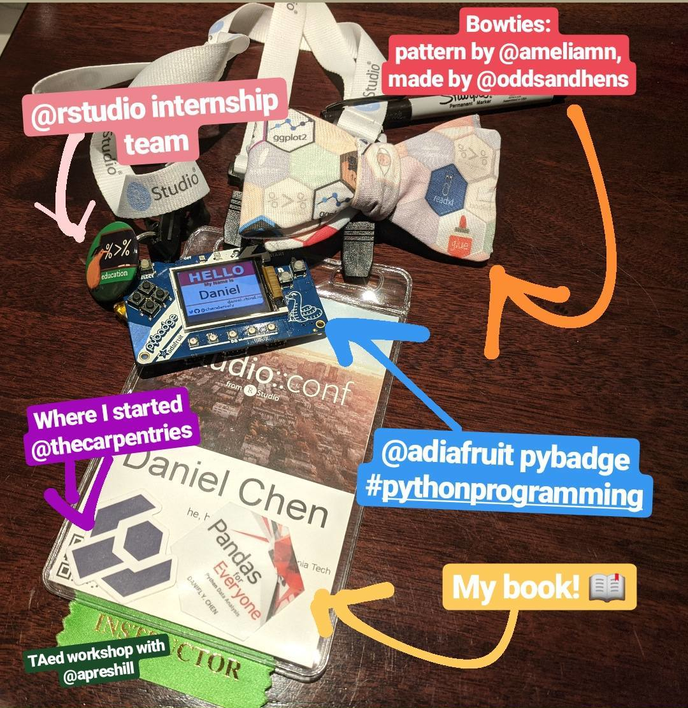
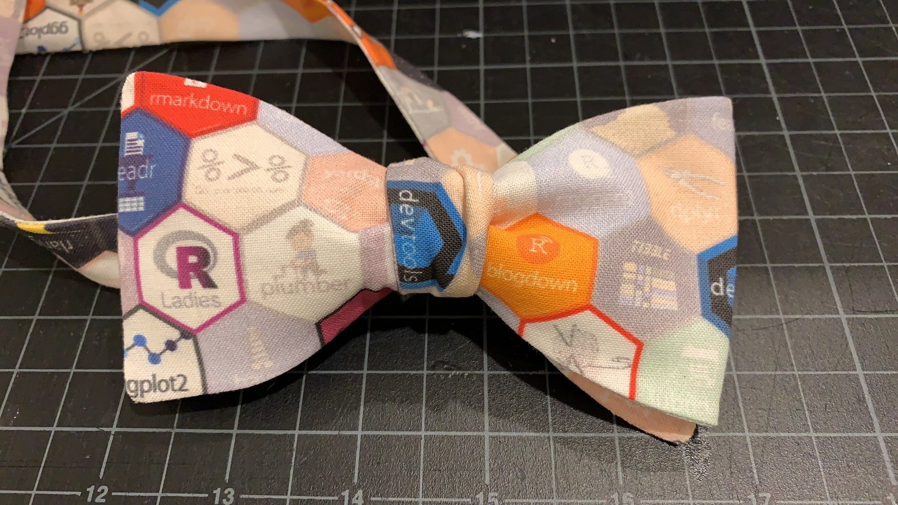
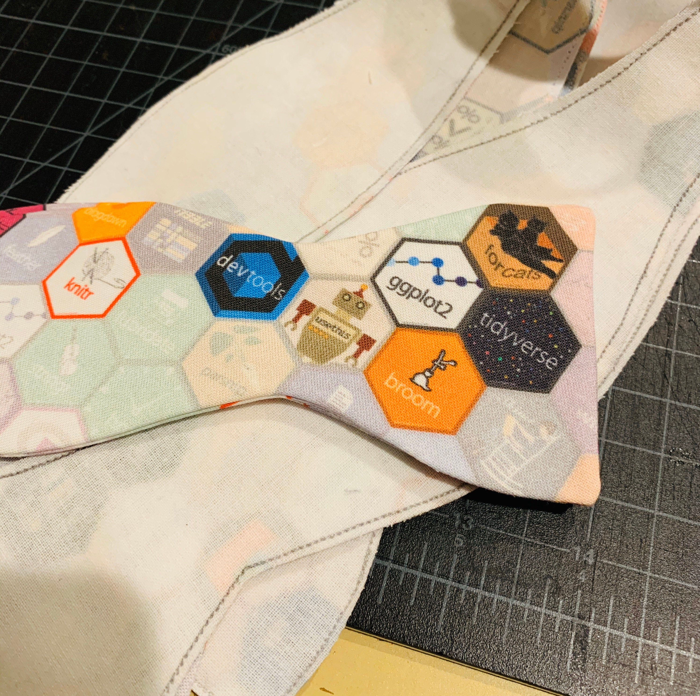
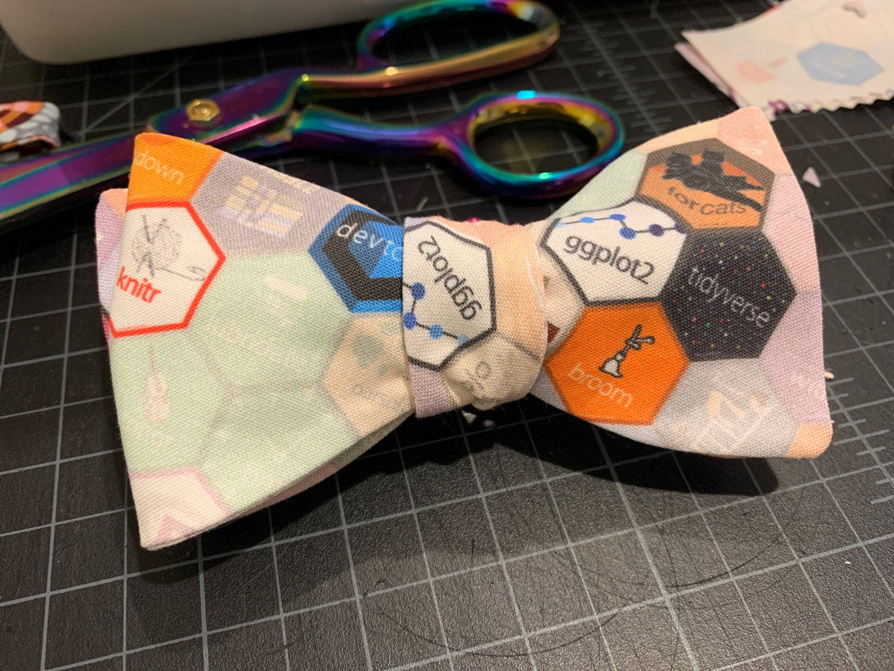
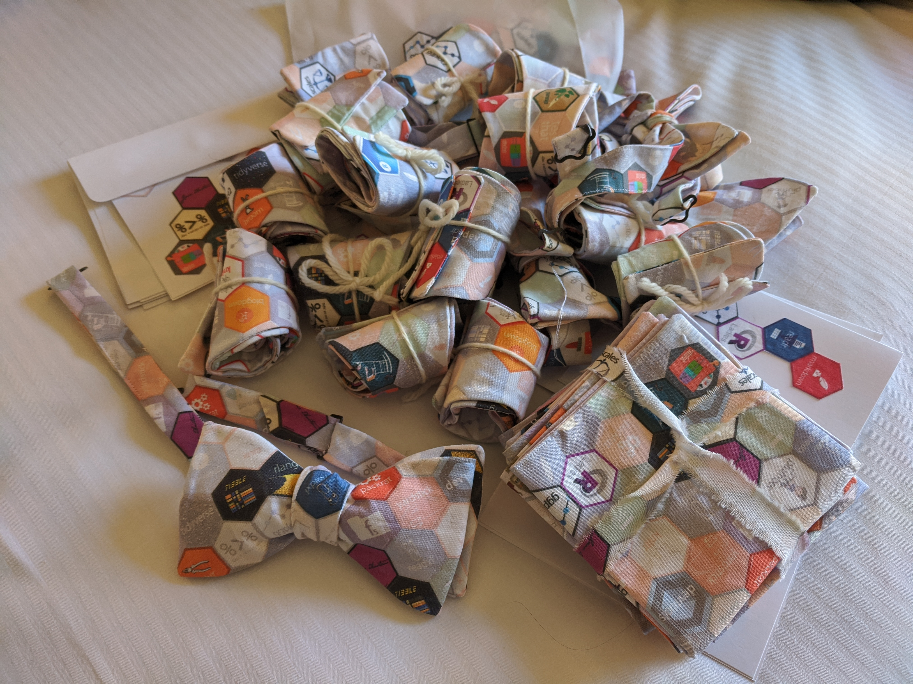
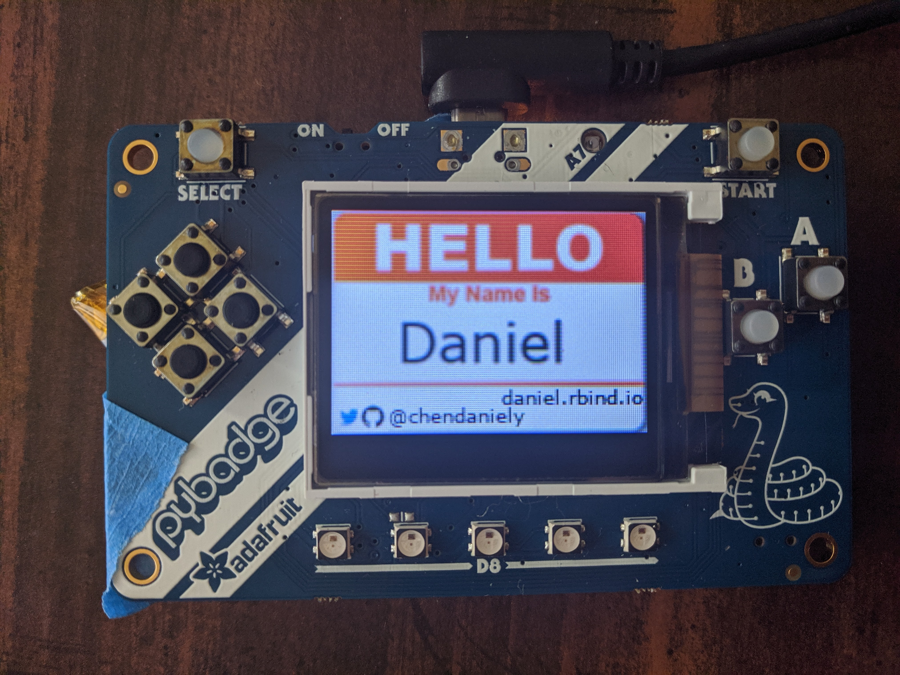

If you were at
[rstudio::conf](https://rstudio.com/conference/)
you may have seen me walking around with my conference badge
and wondered what everything is.

<!--more-->

```{r, echo=FALSE}

```

Yes. That's the #rstats hex bowtie.
Yes, I lost it when Hadley was wearing it for the conference opening notes.

<center>

<blockquote class="twitter-tweet" data-theme="dark"><p lang="en" dir="ltr">Thanks to Daniel Chen for the awesome <a href="https://twitter.com/hashtag/rstats?src=hash&amp;ref_src=twsrc%5Etfw">#rstats</a> bow tie! <a href="https://t.co/OPnawWrltG">https://t.co/OPnawWrltG</a> <a href="https://t.co/XZUj5z7Ox4">pic.twitter.com/XZUj5z7Ox4</a></p>&mdash; Hadley Wickham (@hadleywickham) <a href="https://twitter.com/hadleywickham/status/1222568304088252416?ref_src=twsrc%5Etfw">January 29, 2020</a></blockquote> <script async src="https://platform.twitter.com/widgets.js" charset="utf-8"></script> 

</center>

## Bow Ties are Cool

The R hex fabric is by Amelia McNamara,
which you can get on the
[GitHub repo](https://github.com/AmeliaMN/hexfabric)
or buy directly on her
[Spoonflower page](https://www.spoonflower.com/profiles/ameliamn)

<center>
<blockquote class="twitter-tweet" data-theme="dark"><p lang="en" dir="ltr">Now that the cat’s out of the bag 😻… Yes, I made myself an <a href="https://twitter.com/hashtag/rstats?src=hash&amp;ref_src=twsrc%5Etfw">#rstats</a>/<a href="https://twitter.com/hashtag/tidyverse?src=hash&amp;ref_src=twsrc%5Etfw">#tidyverse</a> dress! <br><br>📸 <a href="https://twitter.com/alexandrabyrne?ref_src=twsrc%5Etfw">@alexandrabyrne</a> with the angles <a href="https://t.co/6m1nJotIwN">pic.twitter.com/6m1nJotIwN</a></p>&mdash; AmeliaMN (@AmeliaMN) <a href="https://twitter.com/AmeliaMN/status/1162359039784673282?ref_src=twsrc%5Etfw">August 16, 2019</a></blockquote> <script async src="https://platform.twitter.com/widgets.js" charset="utf-8"></script> 
</center>

For my particular use case,
I needed smaller hexes because bow ties are just smaller than dresses.
Here's my modified
[1-inch r hex fabirc](https://www.spoonflower.com/designs/9530930-r-hex-fabric-1-hexes-by-chendaniely)

I knew I wanted to make bowties since
I gave a lightning talk during
[RStudio](https://daniel.rbind.io/2020/01/29/my-time-as-an-rstudio-intern/)
[internship](https://education.rstudio.com/blog/2020/02/gestalt-internship/).
And Hadley is a bow tie aficionado.
After talking to a few people,
I was directed to get them made on
[Etsy](https://www.etsy.com/),
and so the hunt to find someone began in November.

The tricky part about finding custom bow ties on Etsy is that many of the
sellers don't make *adjustable* bow ties.
I eventually found
[Megan's](https://www.etsy.com/shop/OddsandHens)
[Shop](https://www.etsy.com/listing/121450912/custom-bow-ties),
which allowed me to get adjustable bowties and use custom fabric.
I placed an order for 20 with the only constraint of one of the bow ties
must have `ggplot2` and `tidyverse` visiable when it is tied (for Hadley).
This is when Megan told me about the original hex size needed to be smaller
for the bow tie.
I also got a few pocket squares in my order too.

I went though the process of creating the smaller hex pattern on
[Spoonflower](https://www.spoonflower.com/designs/9530930-r-hex-fabric-1-hexes-by-chendaniely)
and shipeed 6 yards of the pattern for my order in the "Petal Signature Cotton".
I had to ship Megan the fabric directly since you need to order a test sample
before other people can purchace the pattern.
It was a gamble,
but it was the holiday season,
and the conference was coming up fast.

Megan was great, I got a series of photos about the entire process.

```{r, echo=FALSE}

```

> The fabric is thicker than what I have used previously as spoonflower recently changed to the ‘petal cotton’. I’m just retooling the pattern and interfacing a bit to accommodate it. :)

```{r, echo=FALSE}

```

```{r, echo=FALSE}

```

> Also- here is how the one tie with the prominent ggplotand tidyverse was cut out.

I got the order 2 weeks before the conference and it all turned out wonderfully.

```{r, echo=FALSE}

```

Here's the link to her
[shop](https://www.etsy.com/shop/OddsandHens)
and
[twitter](https://twitter.com/OddsandHens).
I even convinced her to write a
[blog post of her own](https://oddsandhens.com/2020/01/29/bow-ties-make-everything-better/)
.

## PyBadge Name Badge

```{r, echo=FALSE}

```

I went to PyCon for the first time in 2019.
And the
[#pythonhardware](https://twitter.com/hashtag/PythonHardware)
community is amazing.
The conference was filled with people with their own name tags.
I though I'd introduce this to the R community.
And also, gives a way for people to say hello to me,
instead of the other way around :)

I got the bigger
[PyBadge](https://www.adafruit.com/product/4200)
(they also make a
[smaller one](https://www.adafruit.com/product/3939)
).
I really like how Adafruit put python on their circuit boards using
CircuitPython.
It makes programming way more accessiable than using an Arduino,
since you can do all the programming in Python!

In my case I dragged my picture into a folder and it just goes through them in a slide show.


## The Rest

I
[interned](https://blog.rstudio.com/2019/03/25/summer-interns-2019/)
for Rstudio over the summer,
where I was on the
[Education Team](https://education.rstudio.com/).
During rstudio::conf, I TA'ed for the
[Introduction to Machine Learning with the Tidyverse](https://github.com/rstudio-conf-2020/intro-to-ml-tidy)
workshop.

I started teaching as an instructor for
[The Carpentries](https://carpentries.org/).
Which eventually led me to writing my book,
[Pandas for Everyone](https://www.amazon.com/Pandas-Everyone-Analysis-Addison-Wesley-Analytics-ebook/dp/B0789WKTKJ)!


Hope you enjoyed reading about my conference badge!
I look forward to seeing people in the R community add flair to the badges in the future!
