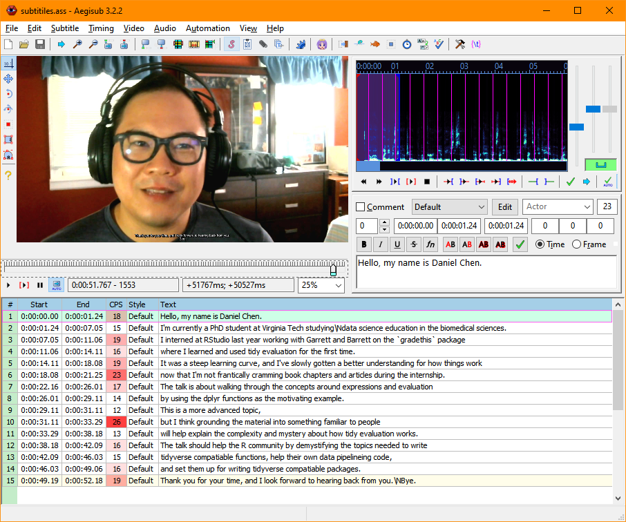

Note: This is a very condensed re-post of the original blog article (hopefully with the same url).
I must've clobbered the original entry with a git push somewhere...

<hr>

Tools:

1. OBS: Record  the screen and/or webcam, https://obsproject.com/
2. Web Captioner: Transcriping the audio during recording, https://webcaptioner.com/
3. Kdenlive: Trim and edit the video, https://kdenlive.org/en/
4. Aegisub: Time the captions and output a subtitle file, www.aegisub.org
5. FFMpeg: Optional if you want to "burn" the subtitles to the video

Web Captioner gives you the option to export out the captions as a plain text file.
You can then use Aegisub to take the text and time them to the video:


```{r}

```

This image shows a snapshot of Aegisub with the video on the top left corner,
and what the timing and text for the subtitles look like.
The numbers highligted in red under the CPS column,
are signifies that too many words may be used in a particular time block.

Once you have the video and the subtitle file (.srt or .ass),
you can use ffmpeg to "burn" in the subtitles so it shows in the video all the time.

Link to the ffmpeg wiki on how to do this: https://trac.ffmpeg.org/wiki/HowToBurnSubtitlesIntoVideo

```bash
ffmpeg -i input.avi -vf "ass=subtitle.ass" output.avi
```
