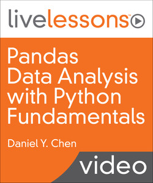

## [Pandas Data Analysis with Python Fundamentals](https://www.oreilly.com/library/view/pandas-data-analysis/9780134692272/) is an online video course.

---

- Pandas Data Analysis with Python Fundamentals
- by Daniel Y. Chen
- Publisher: Addison-Wesley Professional
- Release Date: February 2017
- ISBN: 9780134692272

### Video Description

3+ Hours of Video Instruction

Pandas Data Analysis with Python Fundamentals LiveLessons provides analysts and aspiring data scientists with a practical introduction to Python and pandas, the analytics stack that enables you to move from spreadsheet programs such as Excel into automation of your data analysis workflows.

In this video training, Daniel starts by introducing Python and pandas and why they are great tools for data analysis. He then covers installing and starting Python. The video then moves into the basics of working with data sets in Python and with pandas, followed by plotting and visualization, data assembly and manipulations, missing data, and tidy data. After watching this video, analysts and those new to data science will understand why Python and pandas are so popular with data scientists and should be able to begin to create automated data workflows.

### Skill Level

Beginner to Intermediate

### What You Will Learn

Installing and starting Python Loading data sets into pandas and beginning to assess and analyze them Using pandas data structures and importing/exporting data Combining multiple data sets Dealing with missing data Tidying and reshaping data

### Who Should Take This Course

Analysts and aspiring data scientists looking to move beyond spreadsheets into automated data workflows.

### Course Requirements

Basic understanding of programming and development Some familiarity with basic data analysis

### Table of Contents

#### Lesson 1: Installing and Running Python

Lesson 1 explains why the Python and pandas combination is great for data analysis. It also shows you how to install Python and the analytics stack and how to run Python.

#### Lesson 2: Pandas Basics

Lesson 2 covers some of the initial steps to take after you are given a dataset to analyze. You load data into pandas and then look at different subsets of the data. Finally, you learn how to perform your first simple set of analyses.

#### Lesson 3: Pandas Data Structures

Lesson 3 dives a little further into how pandas works. You learn how to create the pandas series and dataframe data structures. Next, you learn how you can use the pandas series object and pandas dataframe object. Last, how you import and export various types of data are covered.

#### Lesson 4: Introduction to Plotting

Lesson 4 emphasizes why visualization is important. You learn how to create a basic set of plots within matplotlib, Seaborn, and pandas.

#### Lesson 5: Data Assembly

Now that you know how to load and look at your data, the next step is assembling the data you need for analysis. Lesson 5 begins with concatenating data, that is, how to append data along the rows or columns. The lessons end with how to merge multiple data sets together.

#### Lesson 6: Missing Data

By now you have seen a few datasets with missing data. In Lesson 6 we begin to discuss what missing data is and how we get missing data. Your start learning how to work with missing data, including ways to find, count, and clean missing data. These are all important considerations when missing data is used in calculations.

#### Lesson 7: Tidy Data

Lesson 7 is concerned with tidy data. Tidy data describes the shape of your data that makes it easier to manipulate and analyze. The lesson covers Hadley Wickham’s tidy data paper that describes the ways data can be dirty. Finally, it covers the various ways you can reshape data.
