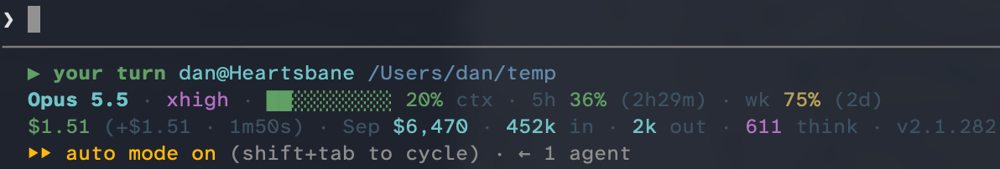

---
# Exported from the Teaching and Learning vault (writing/Incorporating AI in the Classroom - Reviewing with an Agent Harness.md) on 2026-09-27;
# the final wording lives here now.
title: "Incorporating AI in the Classroom: Reviewing with an Agent Harness"
description: "In my first month teaching with AI, an agent did the typing in my review sessions while the class read and judged its commands."
date: "2026-09-27"
categories: [teaching, AI, Incorporating AI in the Classroom]
bibliography: references.bib
# 🤖 web sources linked in the text, listed in References without in-text markers
nocite: |
  @shihiparBuildingAgentsClaude2025, @willisonThinkAgentMay2025, @thecarpentriesLiveCodingSkill2026, @anthropicModelsOverview, @anthropicClaudeFable51
image: 2026-09-26-claude-code-status-bar-card.png
image-alt: "Close crop of Claude Code's status bar in a terminal: it's my turn, the model is Opus 5.5 at extra-high effort, this session has cost $1.51, and auto mode is on."
---

This September was my first month trying to deliberately incorporate AI into my teaching.
I teach in UBC's [Master of Data Science](https://www.grad.ubc.ca/prospective-students/graduate-degree-programs/master-of-data-science) (MDS) program in Vancouver.
My course, [DSCI 521: Computing Platforms for Data Science](https://ubc-mds.github.io/DSCI_521_platforms-dsci_book/),
is taught in the first month of the program.
It's where we introduce students to the computing skills they'll use for the rest of their data science career:
Bash, Git, Quarto, and virtual environments.

Here's what I mean by a few terms I use a lot:

- Model: the large language model (LLM) itself, like Anthropic's [Fable or Opus](https://platform.claude.com/docs/en/models/overview). It only ever writes text, thinking included.
- Agent harness: the software wrapped around the model, like Claude Code ([Anthropic's term for it](https://claude.com/blog/building-agents-with-the-claude-agent-sdk)). It runs the commands the model asks for and feeds the results back, looping until the task is done.
- Agent: the two together, or in Simon Willison's words, something that ["runs tools in a loop to achieve a goal"](https://simonwillison.net/2025/Sep/18/agents/).

I picked up [live coding](https://carpentries.github.io/instructor-training/17-live.html) from my time with [The Carpentries](https://carpentries.org/),
and it's a big part of my teaching style.
It's also the central teaching method in Greg Wilson's *Teaching Tech Together* [@wilsonTeachingTechTogether2019].
More recently, I've carved out the first 10 to 15 minutes of every lecture for a short review of earlier topics,
since students don't always bring what they already know into a new lecture on their own [@lovettHowLearningWorks2023].
Those review sessions used to be live coded too,
but this term an agent (a model running in Claude Code) did the typing.
Instead of watching me retype the commands, the class read what the agent ran and judged it:
a bit of recognition, but mostly evaluation, in Bloom's Taxonomy terms.

I also wanted to show students how people in industry actually use these tools.
Most of their experience with LLMs is through the ChatGPT and Claude apps,
and I wanted them to see an agent harness instead.
I have a Claude Code subscription, so that's the harness I used.
I do want to call out that these tools cost money,
and that cost is a real barrier.
But I wanted students to see them with frontier models,
so everything ran on my screen and nobody had to pay for anything.
Later in the program, MDS does cover how to install and run local models,
and [DSCI 532: Data Visualization 2](https://ubc-mds.github.io/DSCI_532_vis-2_book/), my course on dashboards, is one place students can use them.

## Watching the tool instead of watching me

I showed three of Claude Code's modes:

- Manual mode: it asked before running each command, and I approved every one.
- Plan mode: it wrote out a plan first, and we read it and asked for changes before anything ran.
- Auto mode: it ran everything without stopping to ask.

Switching between them let students see how these harnesses actually behaved
while we reviewed the material.
Each mode had its own way of showing us the actual commands we were learning in class,
and in auto mode we got to watch the harness run them on its own.
That gave students a more accurate mental model of the harness,
close to what @wilsonTeachingTechTogether2019 calls a notional machine
("a general, simplified model of how a particular family of programs executes").
It's not really that magic.

We weren't just silently watching it happen, either.
While the agent was running, I explained what it was doing,
read out some of the thinking and commands it was spitting out,
and reviewed the concepts behind it,
since a run can take a good chunk of time.
Even so, the reviews stayed pretty much capped at those 10 to 15 minutes,
or flowed right into the new lecture topic.

I also put the running cost in my Claude Code status bar,
for the session and for the month,
so everyone could see the token costs as we went and decide for themselves if things were worth it.

{fig-alt="Terminal screenshot of Claude Code's four-line status bar. The third line has the running costs: $1.51 for this session and $6,470 for September so far, next to 452 thousand tokens in, 2 thousand out, 611 thinking tokens, and Claude Code version 2.1.282. The second line shows the model, Opus 5.5 at extra-high effort, the context window 20% full, and 36% of the 5-hour usage limit and 75% of the weekly limit used, resetting in 2 hours 29 minutes and 2 days. The first line says it's my turn and shows my username and working folder, and the last line shows auto mode is on with 1 agent."}

::: {.callout-tip title="Vibe code your own status bar"}
If you use Claude Code, a status bar is a nice low-stakes thing to vibe code yourself.
It's whatever command the `statusLine` entry in `~/.claude/settings.json` points to,
and mine is a shell script saved in `~/.claude/`.
Claude Code even has a `/statusline` command that writes the script and updates your settings for you
(for example, `/statusline show model name and context percentage with a progress bar`).
The [status line docs](https://code.claude.com/docs/en/statusline) list everything your script gets to work with,
including the session's cost and your usage limits
(the month-to-date total isn't in there, so that part takes a little more vibing).
:::

I'm still collecting student reactions,
but one student did say the cost display got them thinking more about what things cost.
I'm not sure the whole point landed, though,
since every number on my screen was token pricing, not what a subscription costs.
That one comment turned into a much bigger conversation about how these tools are priced,
which will be its own post.

## How the modes played out

The first time, I ran it in manual mode,
which was great for a Bash review,
since each command came up for the class to read before it ran.

Early on, Claude was down the morning I was teaching.
My class starts at 8 a.m. in Vancouver, when the whole East Coast is already at work,
and in September the servers were overloaded pretty often.
Luckily, the task was extremely simple:
make a folder, turn it into a Git repository, and push it up,
which you can do yourself in under a minute if you know how.
So we moved on to the lecture, and I ran the demo again later in the class.
30 minutes and 50 cents later, we had a Git repo created on our computer.

In another session I used plan mode,
and a very simple task ended up taking a very long time.
Part of that was on me:
I had it on the Fable model ([Claude Fable 5.1](https://platform.claude.com/docs/en/models/fable-5-1/overview), released September 1, 2026) with max thinking,
and it had to think its way to a plan before it could make a single folder.
The plan came back as a giant wall of text that we had to read
to make sure it would do what we wanted,
and we didn't take the first one either.
We told it what to fix,
and that cycle repeated 3 or 4 times before I accepted it and moved on with the lecture.

For a task that small, you're much better off doing it yourself.
Knowing when to use a skill is part of mastering it [@lovettHowLearningWorks2023], and the same goes for tools.
Plan mode makes more sense for more complicated tasks,
but the time you would have spent looking up documentation and writing the code doesn't go away.
It just shifts to reviewing the plan, and you have to read it closely.

By the time we tried auto mode,
the class had seen the other two modes and knew where I keep my repositories.
I asked it to create a repository for the day's date and start a Quarto project in it.
It did everything correctly,
and then put the folder somewhere other than my `git` folder
(either on my desktop or in my home directory).

::: {.callout-tip title="Keep your repositories in one place"}
Every Git repository I have lives in one `git` folder in my home directory (`~/git/`),
organized into subfolders,
so I always know where to find them.
It's a good practice, and something I talk about a lot in class.
:::

It's a very benign example of the agent doing exactly what I told it to do,
just not the way I wanted it done.
It goes to show that you have to be specific with these tools,
and you can't just blindly auto mode everything.

## Instructions for something that doesn't need to learn

All of this is a lot like writing homework assignments.
Sometimes the instructions are vague on purpose and things go awry,
and sometimes they're so detailed that students blindly follow them without learning anything,
so we're always balancing the two.
The LLM doesn't need to learn anymore.
It just needs to do.
So be specific about what you want it to do,
and just as specific about what you don't.
Both show you understand the material,
and so does being able to assess the results, which was always the thing.
It was never really about the code
(and sometimes, you should just make the folder yourself).
