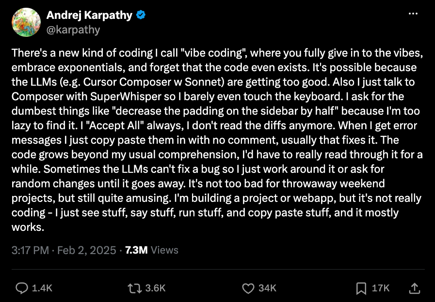
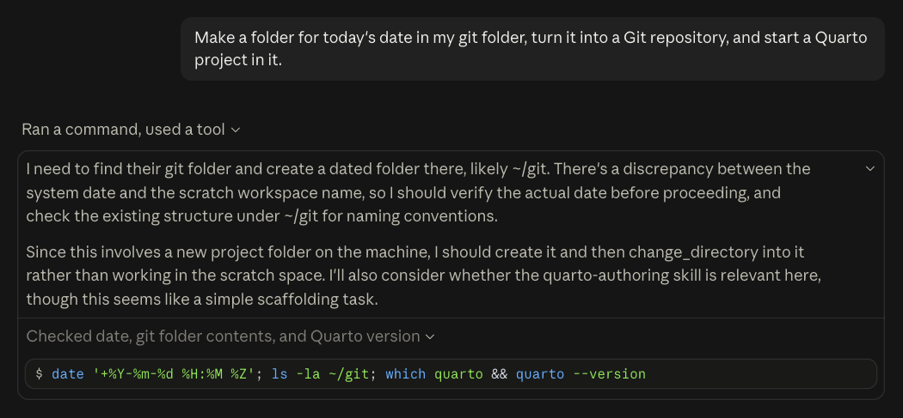

---
# Exported from the Teaching and Learning vault (writing/Incorporating AI in the Classroom - Using AI to Learn, and Learning the AI.md) on 2026-10-07;
# the final wording lives here now.
# 🤖 copyedited 2026-10-08 in pi with qwen3.8-27b; Dan chose which fixes to apply
title: "Incorporating AI in the Classroom: Using AI to Learn, and Learning the AI"
description: "There are 2 things I want students to get out of AI in class: using AI to learn something, and just doing stuff to learn the AI."
date: "2026-10-07"
categories: [teaching, AI, Incorporating AI in the Classroom]
bibliography: references.bib
# 🤖 web sources linked in the text, listed in References without in-text markers
nocite: |
  @mcgowanAnalyticDesignTheory, @rooseAIMobThat2026, @karpathyLlmwiki2026, @karpathyTheresNewKind2025, @ubcspphCoursesSchedules, @githubAboutCopilotAuto, @greenblattBriefIndependentInvestigation2026
image: 2026-10-07-claude-code-thinking-card.png
image-alt: "Close crop of Claude Code in the desktop app: the model's thinking, which starts \"I need to find their git folder and create a dated folder there, likely ~/git\", above the first command it ran. See alt-text in blog for full image text."
---

::: {.callout-note title="Part of a series"}
This is the second post in my [Incorporating AI in the Classroom](/blog.qmd#category=Incorporating%20AI%20in%20the%20Classroom) series.
More to come!
:::

This term I'm using AI on purpose in 2 of the courses I teach at UBC.
The first is my own course,
[DSCI 521: Computing Platforms for Data Science](https://ubc-mds.github.io/DSCI_521_platforms-dsci_book/),
in the [Master of Data Science](https://www.grad.ubc.ca/prospective-students/graduate-degree-programs/master-of-data-science) program.
The second is [SPPH 381H: Health Data Science: AI and Knowledge Translation](https://ehsanx.github.io/HDSx/).
There are 2 things I want students to get out of AI in class.
There's using AI to learn something,
and then there's just doing stuff to learn the AI.

## Using AI to learn something

The first thing is using AI to learn the course material itself.

### What it looks like in class

In DSCI 521, this mostly happened in my review sessions.
We'd go over the concepts,
then watch an agent do a similar task using the same commands we had just talked about,
which I think helped solidify them
(I wrote about those sessions in my [last post](/posts/2026/2026-09-27-reviewing-with-an-agent-harness/index.qmd)).

In SPPH 381H, we still go through the concepts,
but then we go into AI-assisted coding,
with [GitHub Copilot](https://github.com/features/copilot) in [GitHub Codespaces](https://github.com/features/codespaces).
The course has [no coding prerequisites](https://spph.ubc.ca/education/courses-and-schedules/),
and students use Copilot's free tier,
where [Auto](https://docs.github.com/en/copilot/concepts/models/auto-model-selection) picks the model for them.
I drive Copilot in the class demos,
but it's to show students how they can use it themselves.
The AI-KT teaching team also wrote a lot of AI prompts into the course materials that students can use with Copilot on their homework.
AI is built right into the course,
and one of its goals is for students to use LLMs to "generate, debug, and translate code while critically auditing them for bias and hallucinations".

::: {.callout-note title="About SPPH 381H"}
SPPH 381H isn't my course.
It's an open course developed by Dr. M. Ehsan Karim of UBC's School of Population and Public Health,
with the AI-KT team (Manya Jain, Rainie Fu, and Md. Belal Hossain),
and shared as "an open educational resource for learners and adopting instructors" [@karimHealthDataScience2026].
I'm the first instructor for the course,
even though it was developed by all of these other people
(I just happen to be a good instructional fit for teaching it).
:::

A typical class goes like this:
we teach a concept,
students ask a research question,
the code shows up,
we try to read the code,
and then we see the result.
We already teach code in a similar way, even without AI:
we teach a concept,
show a more complicated example,
have students guess what might happen,
and then show them the result.
A fuller version of this pattern is PRIMM
(predict, run, investigate, modify, and make).
I first read about it in Greg Wilson's *Teaching Tech Together* [-@wilsonTeachingTechTogether2019],
and it comes from Sue Sentance and Jane Waite, who wrote it up with Maria Kallia [-@sentanceTeachingComputerProgramming2019].
I'm not using PRIMM in class right now:
I mostly live code and demo things,
with the agent typing a lot of it.
But since AI frees up some class time,
PRIMM is a format that can fit in,
and now that we're a month into the term, it's something I'm considering.

What I've learned is that AI-assisted coding really cuts down on the time we spend talking about the details of the code.
Since we aren't stuck on the code,
we can start thinking about the data and the next set of questions to ask of it.
That reminds me of what Lucy D'Agostino McGowan, Stephanie Hicks, and Roger Peng call [analytic design theory](https://analyticdesigntheory.org/),
"the study of how data analyses are conducted in the real world".
It was never really about the code;
it's about the thinking behind it.
Copilot helps students write less code,
and the point is for them to read and assess more of it,
which I think is a good thing.

We'll see how well this works for students in the long term.
That's an open question for education in general,
which is in an assessment crisis right now with AI.

### Know what your tools can do

The flip side of letting AI write the code showed up in DSCI 521.
One homework assignment had students filling in [Quarto reveal.js slides](https://quarto.org/docs/presentations/revealjs/),
and some of the slides ended up with too much text.
The [assignment's instructions](https://ubc-mds.github.io/DSCI_521_platforms-dsci/assignments/lab3-group.html) said Quarto has a built-in option for exactly this,
and where to find it in the documentation,
but didn't name it, on purpose.
One student (using ChatGPT, the way they normally do)
had it rewrite all of the CSS to work around the problem instead,
when the fix was a one- or two-liner, Quarto's [`.smaller` class](https://quarto.org/docs/presentations/revealjs/index.html#content-overflow).

When I know the tool I'm using and where its documentation lives,
I always feed that documentation to the LLM.
LLMs can do a lot of this stuff for you,
but you still need to know what your other tools (like Quarto) are already capable of,
or the LLM is going to go off and do something you don't want.

It happened to me while writing this post.
I asked Claude for a fun way to define vibe coding,
and it built a custom card from scratch, with about 40 lines of CSS and a bit of JavaScript.
Quarto could already do it with a callout extension,
and I only knew to ask for that because I know Quarto.
I wrote it up as a [learning moment](https://chendaniely.github.io/genai-learning-moments/posts/2026-10-07-use-the-framework-first.html),
one of the [examples I keep of correcting AI output](https://chendaniely.github.io/genai-learning-moments/).

<!-- 🤖 definition callout (custom-callout extension, set up in _quarto.yml); Karpathy's post is a screenshot with the image linked to the original X post -->
::: {.definition}
## [Definition:]{aria-hidden="true"} vibe coding [/vaɪb ˈkoʊdɪŋ/]{aria-hidden="true"} *noun*

Andrej Karpathy's term for coding where you "fully give in to the vibes, embrace exponentials, and forget that the code even exists."

[{fig-alt="Screenshot of a post on X by Andrej Karpathy, @karpathy, with a verified badge. The post reads: There's a new kind of coding I call “vibe coding”, where you fully give in to the vibes, embrace exponentials, and forget that the code even exists. It's possible because the LLMs (e.g. Cursor Composer w Sonnet) are getting too good. Also I just talk to Composer with SuperWhisper so I barely even touch the keyboard. I ask for the dumbest things like “decrease the padding on the sidebar by half” because I'm too lazy to find it. I “Accept All” always, I don't read the diffs anymore. When I get error messages I just copy paste them in with no comment, usually that fixes it. The code grows beyond my usual comprehension, I'd have to really read through it for a while. Sometimes the LLMs can't fix a bug so I just work around it or ask for random changes until it goes away. It's not too bad for throwaway weekend projects, but still quite amusing. I'm building a project or webapp, but it's not really coding - I just see stuff, say stuff, run stuff, and copy paste stuff, and it mostly works. Posted at 3:17 PM on Feb 2, 2025, with 7.3M views, 1.4K replies, 3.6K reposts, 34K likes, and 17K bookmarks."}](https://x.com/karpathy/status/1886192184808149383)
:::

## Doing stuff to learn the AI

The other thing I want students to see is how these tools work.
Most students only know how to talk to an LLM through a chatbot,
not through a harness, and they've never seen one running as an agent
(I went over what I mean by those in my [last post](/posts/2026/2026-09-27-reviewing-with-an-agent-harness/index.qmd)).
In SPPH 381H, I get a lot of cool head nodding (and some wide eyes) when the agent does something on its own.
It's such a different way of interacting with AI,
and those eyes and nods tell me it's worth showing.

### Showing what's under the hood

In DSCI 521, I ran one of my reviews in Claude Code on the desktop app,
since it's a little bit easier to toggle the model's thinking there.
With the thinking visible,
we could see how much text the model generates before it does anything,
and all of that text is tokens, which is time and money.
We also got to compare what it wrote while it was thinking with what it told us.
I did this because of a [September episode of Hard Fork](https://podcasts.apple.com/us/podcast/hard-fork/id1528594034?i=1000787837136) (a New York Times podcast) about the incident where OpenAI's AI agents hacked into Hugging Face.
The [investigators](https://metr.org/blog/2026-08-26-openai-hugging-face-incident-investigation/) could read the AI agents' thinking,
and some of the agents were working out how to fake their own logs,
so what the logs showed wasn't always what the agents had actually done.
The hack itself had nothing to do with DSCI 521,
but it's what got me wanting to show students what's actually happening under the hood.

{fig-alt="Dark-mode screenshot of a Claude Code session in the Claude desktop app. My prompt: “Make a folder for today's date in my git folder, turn it into a Git repository, and start a Quarto project in it.” Below it, under the heading “Ran a command, used a tool”, is the model's thinking in two paragraphs: “I need to find their git folder and create a dated folder there, likely ~/git. There's a discrepancy between the system date and the scratch workspace name, so I should verify the actual date before proceeding, and check the existing structure under ~/git for naming conventions.” “Since this involves a new project folder on the machine, I should create it and then change_directory into it rather than working in the scratch space. I'll also consider whether the quarto-authoring skill is relevant here, though this seems like a simple scaffolding task.” Then, under “Checked date, git folder contents, and Quarto version”, the command it ran: $ date '+%Y-%m-%d %H:%M %Z'; ls -la ~/git; which quarto && quarto --version"}

### Building my own projects

But watching only goes so far,
and much of what I know about how these tools behave came from building things for myself.
I have a growing list of [vibe-coded projects](/projects/index.qmd#vibe-coded-projects) on my website,
small tools and websites I built by pairing with an AI coding agent.
I did the websites entirely in plan mode and auto mode,
because I don't know JavaScript, HTML, or CSS, and I'm not planning on learning them right now.
I just wanted to build the cool projects I had in my head,
and my subscription let me make something as soon as I thought of it.

These projects are just the code I want to exist in the world for myself
(and maybe they'll be useful for other people),
and sometimes I even get to bring in what I already know to direct them,
mostly things around Quarto and GitHub Pages deployments.
If something goes wrong, it doesn't really affect anyone else,
which makes them a good place to try stuff out.
That's how I learned different ways to use an LLM,
like [Karpathy's LLM wiki](https://gist.github.com/karpathy/442a6bf555914893e9891c11519de94f) method,
where an LLM keeps a wiki of your notes and sources up to date.
I keep my teaching and learning notes in one,
and I've moved my main Obsidian vault over too,
using Claude to reorganize my projects and folders.

## Why I want both

What I'm trying to show students is that you need to go and use these tools yourself to see what they're actually capable of,
and that's separate from using them in my classroom to learn data science.
It's also why it's fine for me to vibe code a website without knowing any CSS,
but not for a student whose homework is about learning Quarto.
In class, the code is the thing you're learning to judge,
while in my own projects it can stay out of sight.
I understand a lot more of the language people use around agentic coding now,
because I've done it myself.

Learning to use these AI tools was itself learning with an LLM,
so it's circular in a way.
But they're still 2 different things I want to expose students to,
and 2 different ways to learn.
The end goal, hopefully, is knowing both,
so you can pick whichever fits the task at hand.
Not everything you do with these tools has to be fully understood,
and you can totally use them for fun.
