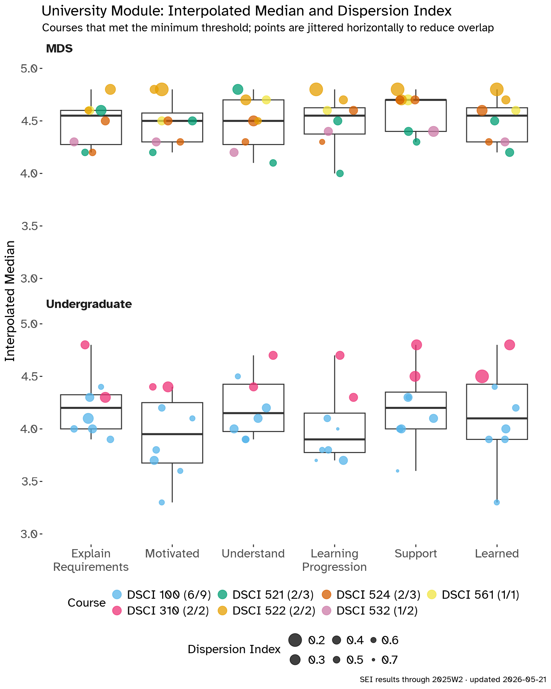
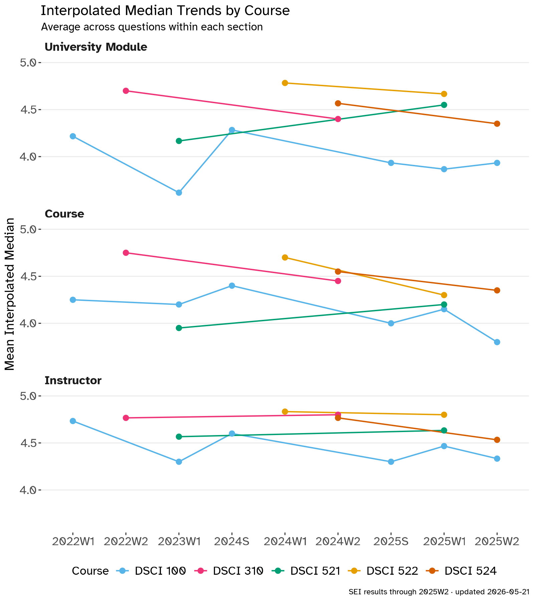

<!-- 🤖 my UBC MDS headshot from 2022, my first year at UBC and MDS; floated left so the intro wraps around it:
     Bootstrap's float-sm-start floats it from tablet width up, and on phones it
     sits above the text instead of squeezing it; the clearfix keeps the
     Open textbooks cards below the photo -->
:::: {.clearfix}
{.d-block .float-sm-start .me-sm-4 .mb-3 .rounded-3 .shadow-sm width="220"}
I'm a Lecturer in the
[Department of Statistics](https://www.stat.ubc.ca/)
at the University of British Columbia,
where I've taught since 2022
(I started as a Postdoctoral Research and Teaching Fellow).
I teach introductory data science to undergraduates,
and the computing, workflow, and visualization courses
in the [Master of Data Science](https://masterdatascience.ubc.ca/) (MDS) program.
This term (fall 2026) I'm teaching my MDS course, DSCI 521,
and I'm the first instructor for
[SPPH 381H: Health Data Science: AI and Knowledge Translation](https://ehsanx.github.io/HDSx/).

My teaching outside UBC,
and how I think about teaching in general,
is on my main [Teaching](/teaching/index.qmd) page.
::::

## Open textbooks

I co-author and maintain the open textbooks my MDS courses run on.
They're public, so anyone can learn from them or teach with them.

:::: {.signposts}
::: {.signpost}
### 🔁 Reproducible & Trustworthy Workflows

Version control, environments, containers, testing, CI/CD, and packaging.
Used in DSCI 310, 522, and 524.

[read the book →](https://ubc-dsci.github.io/reproducible-and-trustworthy-workflows-for-data-science/){.stretched-link}
:::

::: {.signpost}
### 💻 Computing Platforms for Data Science

Bash, Git, Quarto, and virtual environments,
the computing skills students use for the rest of the program.
Used in DSCI 521.

[read the book →](https://ubc-mds.github.io/DSCI_521_platforms-dsci_book/){.stretched-link}
:::

::: {.signpost}
### 📊 Data Visualization II

Dashboards with Shiny in R and Python,
interactive maps,
and AI-powered apps.
Used in DSCI 532.

[read the book →](https://ubc-mds.github.io/DSCI_532_vis-2_book/){.stretched-link}
:::
::::

## Courses

| Course | Title | Terms taught |
|--------|-------|--------------|
| DSCI 100 | Introduction to Data Science (R and Python sections) | 2022S, 2022W1, 2023S, 2023W1, 2023W2, 2024S, 2025S, 2025W1, 2025W2 |
| DSCI 310 | Reproducible and Trustworthy Workflows for Data Science | 2022W2, 2024W2 |
| DSCI 521 | Computing Platforms for Data Science | 2023W1, 2024W1, 2025W1, 2026W1 |
| DSCI 522 | Data Science Workflows | 2024W1, 2025W1 |
| DSCI 524 | Collaborative Software Development | 2022W2 (lectures), 2024W2, 2025W2 |
| DSCI 532 | Data Visualization II | 2024W2, 2025W2 |
| DSCI 554 | Experimentation and Causal Inference | 2021W2 (labs) |
| DSCI 561 | Regression I | 2022W1 (labs) |
| DSCI 591 | MDS Capstone Project | capstone mentor every year since 2022 |
| SPPH 381H | Health Data Science: AI and Knowledge Translation | 2026W1 |

: UBC terms: W1 runs September–December, W2 runs January–April of the following year, and S is summer. So 2025W2 is spring 2026. {.striped .hover}

SPPH 381H isn't my course.
It was developed by Dr. M. Ehsan Karim of UBC's School of Population and Public Health
with the AI-KT team (Manya Jain, Rainie Fu, and Md. Belal Hossain),
and I happen to be a good fit to teach it.

I also run office hours for the
[Health Data Analytics micro-certificate](https://extendedlearning.ubc.ca/programs-credentials/health-data-analytics-opportunities-applications-microcertificate)
through UBC Extended Learning:
[Health Data and Visualization](https://extendedlearning.ubc.ca/courses/health-data-visualization/0115) (2024–2026)
and [Health Data Analysis and Machine Learning](https://extendedlearning.ubc.ca/courses/health-data-analysis-machine-learning/0116) (2024).

## Teaching with AI

This term I'm using AI on purpose in both of my courses,
and there are 2 things I want students to get out of it.
There's using AI to learn something,
and then there's just doing stuff to learn the AI.

In DSCI 521, an agent now does the typing in my review sessions.
Instead of watching me retype the commands,
the class reads what the agent ran and judges it
(a bit of recognition, but mostly evaluation, in Bloom's Taxonomy terms),
and the running token cost sits on the screen the whole time.
I wrote about how those sessions went in
[Reviewing with an Agent Harness](/posts/2026/2026-09-27-reviewing-with-an-agent-harness/index.qmd).

In SPPH 381H, which has no coding prerequisites,
students use GitHub Copilot to write the code for their research questions,
and we spend class time reading that code and the results it gives back.
Since we aren't stuck on the details of the code,
we get to spend more time on the data and the next question to ask of it.
It was never really about the code,
it's about the thinking behind it.
That post is
[Using AI to Learn, and Learning the AI](/posts/2026/2026-10-07-using-ai-to-learn-and-learning-the-ai/index.qmd).

Assessment is the hard part,
and education in general is in an assessment crisis right now with AI.
DSCI 521 no longer has exams;
instead, every student builds a personal website that starts their professional portfolio,
on the bet that when your name is on the work, you don't want it to be AI slop.
In DSCI 100 we've been moving exam questions toward reading and reasoning about code,
since whether a student can write code from scratch tells me less than it used to.
I also keep a collection of [learning moments](https://chendaniely.github.io/genai-learning-moments/),
examples of correcting AI output where knowing the tool made the difference.

This is all still changing,
so the newest version of this section is my
[Incorporating AI in the Classroom](/blog.html#category=Incorporating%20AI%20in%20the%20Classroom)
series on the blog.

## Recent course work

I change my courses a little every year,
and some of those changes end up moving the whole MDS program along with them.

### 2026–27 (in progress) {#course-work-2026-27}

Most of this year's changes are about Python tooling,
and they started in DSCI 521 since that's where students first set everything up.

- **All of MDS:**
  Python environments are moving from `conda` to [`uv`](https://docs.astral.sh/uv/) and `uv.lock` files,
  a core tooling change for the whole program,
  and we're migrating to the [Positron](https://positron.posit.co/) IDE this year.
- **DSCI 522:**
  reproducible environments with `uv` and `uv.lock` files,
  replacing `conda-lock`.
- **DSCI 524:**
  `uv` for all Python packaging,
  following where the [Python Packages](https://github.com/py-pkgs/py-pkgs) book is likely headed
  and moving closer to the [pyOpenSci](https://www.pyopensci.org/python-package-guide/) materials.
  Last year the documentation moved from ReadTheDocs and Sphinx to `quartodoc`,
  and this year it's moving again, to [Great Docs](https://posit-dev.github.io/great-docs/).

### 2025–26 {#course-work-2025-26}

- **DSCI 532 (2025W2):**
  rewrote the course around [Shiny](https://shiny.posit.co/) for R and Python,
  replacing Dash,
  and added AI-powered dashboards with `chatlas` and `querychat`.
  The [textbook](https://ubc-mds.github.io/DSCI_532_vis-2_book/)
  and the [student project showcase](https://github.com/UBC-MDS/DSCI_532-projects)
  are now public.
- **DSCI 100:**
  moved the course project to GitHub Classroom with checkpoint due dates,
  spreading feedback (and grading) across the term.
- **DSCI 522:**
  reproducible Python environments with `conda-lock`
  and multi-architecture Docker images,
  with a [reference repository](https://github.com/chendaniely/docker-condalock-jupyterlab)
  showing the whole workflow end to end.
- **DSCI 524:**
  switched Python packaging to `hatch`,
  following the [pyOpenSci packaging guide](https://www.pyopensci.org/python-package-guide/),
  and documentation to Quarto and `quartodoc`
  with live previews on every pull request.

## Student evaluations

At the end of every course,
UBC asks students to fill out a
[Student Experience of Instruction](https://seoi.ubc.ca/) (SEI) survey.
If you found me through [Rate My Professors](https://www.ratemyprofessors.com/professor/2808322),
you've seen my 3.1 out of 5.
As a data scientist, I'd like to point out that's 14 ratings,
and the plots below come from 727 SEI responses across 24 course sections since 2022
(I'll let you decide which sample you trust).

The plots use UBC's interpolated median,
a median on the 1 to 5 scale that accounts for how the ratings are spread out,
and they only include sections that met UBC's minimum response rate.

*Figures updated 2026-05-21, with SEI results through 2025W2 (spring 2026).
I update them a few times a year, once all of a term's SEI reports are in.*

{fig-alt="Two panels of box plots of interpolated median scores, from 3 to 5, for UBC's 6 University Module questions: explain requirements, motivated, understand, learning progression, support, and learned. In the MDS panel, every course section scores between 4.0 and 4.8 on every question, with medians around 4.5. In the undergraduate panel, DSCI 310 sections score between 4.3 and 4.8, while DSCI 100 sections spread from about 3.3 to 4.5, lowest on motivated and learning progression."}

::: {.callout-note collapse="true" title="What's in this figure"}
Students rate each statement from 1 (strongly disagree) to 5 (strongly agree).
These are UBC's 6 University Module questions,
which every instructor gets asked:

- **Explain Requirements**: Throughout the term, the instructor explained course requirements so it was clear to me what I was expected to learn.
- **Motivated**: The instructor conducted this course in such a way that I was motivated to learn.
- **Understand**: The instructor presented the course material in a way that I could understand.
- **Learning Progression**: Considering the type of class (e.g., large lecture, seminar, studio), the instructor provided useful feedback that helped me understand how my learning progressed during this course.
- **Support**: The instructor showed genuine interest in supporting my learning throughout this course.
- **Learned**: Overall, I learned a great deal from this instructor.

How to read it:

- **Points**: one course section each, colored by course and nudged sideways so they don't overlap.
- **Boxes**: the median and middle half of all the sections for that question.
- **Point size**: UBC's dispersion index, flipped, so bigger points mean students agreed with each other more.
  The index runs from 0 (everyone gave the same rating) to 1 (students split evenly between strongly disagree and strongly agree).
- **Panels**: MDS courses on top, undergraduate courses on the bottom.
- **Legend counts**: sections plotted out of sections with SEI results,
  since sections below UBC's minimum response rate are left out
  (for example, 6/9 means 6 of 9 DSCI 100 sections are shown).
:::

In my MDS courses,
every section scores between 4 and 4.8 out of 5 on every question.
DSCI 100, the big intro course with about 100 to 175 students a term,
is where my scores are lowest,
mostly on feeling motivated and on getting feedback about how their learning is going.
That's also where most of my course changes have gone,
like the code review sessions, worked examples, and checkpoint projects.
DSCI 310 sits at the top of the undergraduate panel,
and its 2022W2 offering got **Dean of Science recognition**
for some of the highest student evaluation scores in the UBC Faculty of Science.

{fig-alt="Three panels of line charts from 2022W1 to 2025W2, one each for University Module, Course, and Instructor questions, with one line per course: DSCI 100, 310, 521, 522, and 524. On the instructor questions, every course stays between about 4.3 and 4.8. DSCI 521 rises on all 3 panels between 2023W1 and 2025W1. DSCI 522 is highest, around 4.7 to 4.8. DSCI 100 dips to about 3.6 on the University Module questions in 2023W1, recovers to 4.3 in 2024S, and sits around 3.9 since 2025."}

::: {.callout-note collapse="true" title="What's in this figure"}
Each panel averages the interpolated medians of one set of questions,
for each course in each term.

- **University Module**: the 6 UBC questions from the figure above.
- **Course**: 2 questions about the course itself.
  - My academic background provided sufficient preparation for this course.
  - In this class, I applied facts, theories, or methods to new problems or situations.
- **Instructor**: 3 questions about the instructor.
  - The instructor treated students with respect.
  - The ways the instructor implemented the course activities (e.g., in-class activities, labs, tutorials, field trips, online components, assignments) helped me achieve the learning objectives.
  - The instructor was intentional about cultivating a welcoming and inclusive environment that supports all students and encourages all students to participate.

Each line is one course,
and a course only shows up once it has at least 2 terms that met UBC's minimum response rate
(so DSCI 532 and DSCI 561 aren't here yet).
Lines only connect the terms where a course was taught and met the response rate,
which is why some of them jump across a few terms.
:::

Over time,
the questions about me as an instructor have stayed between about 4.3 and 4.8 in every course.
DSCI 521 went up on all 3 sets of questions between 2023W1 and 2025W1,
and DSCI 100 dipped in 2023W1 and has hovered just under 4 on the University Module questions since 2025.

In the written comments,
students bring up how approachable I am more than anything else,
along with how much they get out of watching me live code
(the most common request is for me to slow down during those demos, which is fair).
Student comments are confidential,
so I don't quote any of them here.
